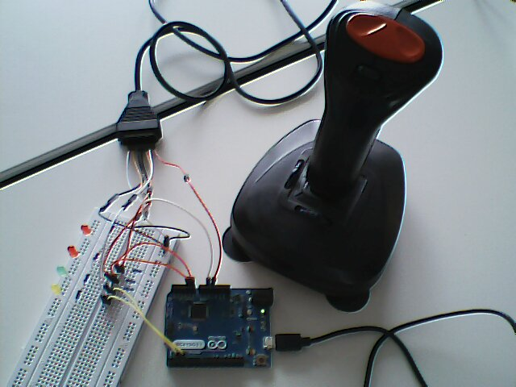

# Game Port vers USB

Du code pour utiliser un vieux joystick avec connectique [Game Port](http://pinouts.ru/Inputs/GameportPC_pinout.shtml) comme un périphérique USB (joystick USB ou souris) via la spécification [USB HID](https://en.wikipedia.org/wiki/USB_human_interface_device_class).

Pour le test des joysticks sous Linux, on peut utiliser `jstest` (dans les paquets Ubuntu/Debian).

